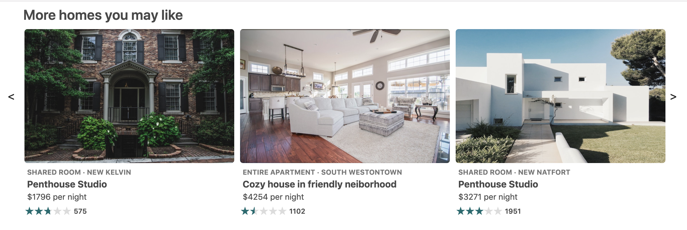

# More homes you may like

Suggestion module for the vacation rental app that displays 12 more homes. Each component is clickable and redirects user to the main page of the clicked house. User can scroll to the left and right to see all suggestions. The app is responsive to resizing.



## Installation

Step 1: Clone the repo
```
$ git clone https://github.com/InnCognito/service-relatedhomes.git
```

Step 2: Start your local PostgreSQL service.

Step 3: Generate and seed data 
```javascript
$ node db/dataGeneration/createData.js
```
```javascript
$ bash db/postgreSQL/start.sh
```
Step 4: Compile files with webpack
```javascript
$ npm run build
```

Step 5: Start the app
```javascript
$ npm start
```

Extra: To run tests
```javascript
$ npm run test
```

Extra: To update screenshots for tests
```javascript
$ npm run updateTestSnapshot
```

## Related Projects

* https://github.com/InnCognito/proxy-relatedhomes
* https://github.com/InnCognito/service-info
* https://github.com/InnCognito/service-reviews
